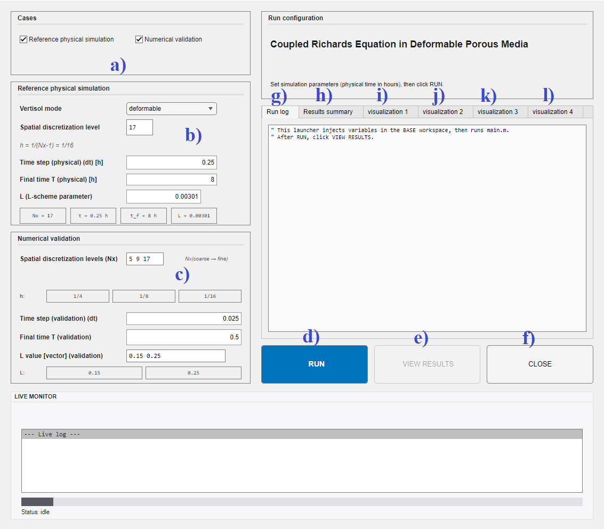
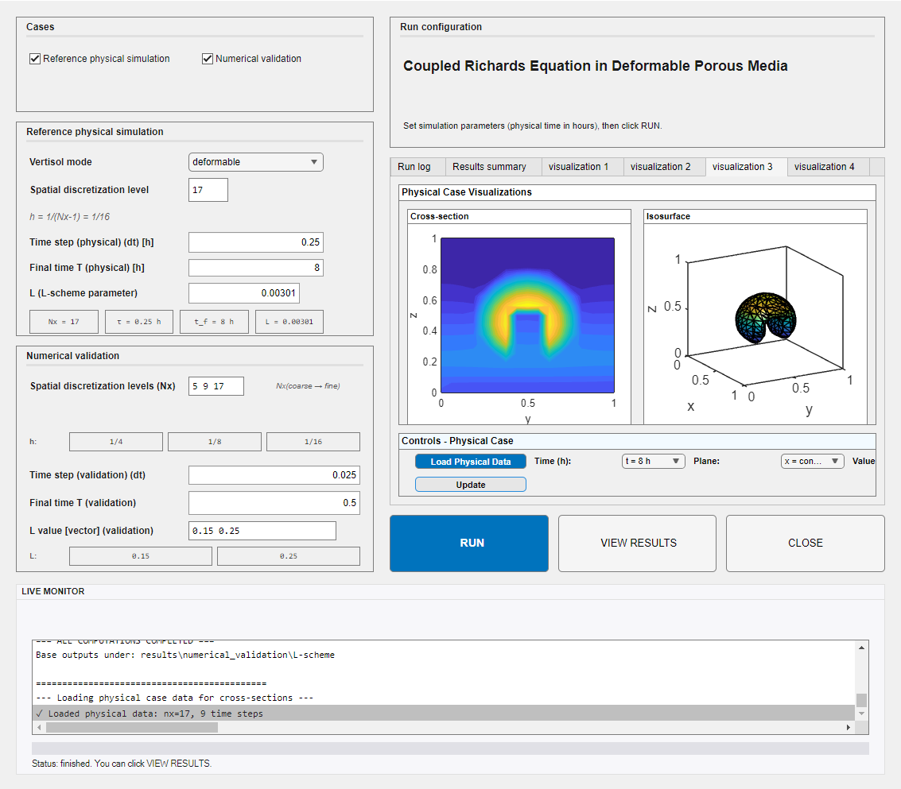
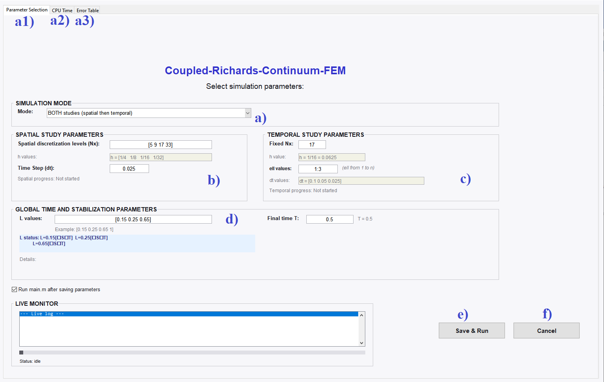
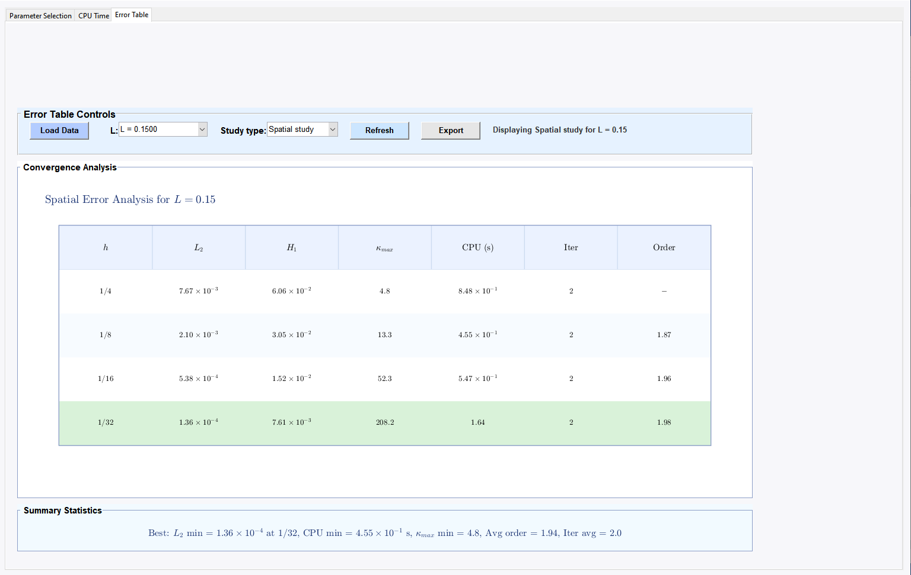

# Coupled Richards Equation in Deformable Porous Media  
## Finite Element Framework for 2d and 3d Flow Simulations

---

## Overview

This repository provides a MATLAB finite element implementation of the coupled Richards equation in deformable porous media. The objective is to provide a reproducible computational framework for simulations in deformable porous media, with specific applications to swelling clays.

---

## 3d Simulations

The 3D numerical simulations represent the central contribution of this study.

First, they are designed to validate the numerical scheme for various values of the L-parameter, allowing a systematic assessment of its stability, convergence behavior, and robustness. The analysis includes error convergence evaluation, iteration counts, CPU times, and matrix conditioning.

A second validation stage is performed by incorporating swelling clay samples, in order to evaluate the scheme under physically relevant deformable porous media conditions, with particular attention to computational performance and numerical stability indicators.

Finally, a reference physical configuration is considered, based on an initially fractured spherical geometry with a zero source term. This scenario enables both a detailed performance analysis of the numerical scheme and an investigation of hydraulic transfer processes in deformable porous media.

---

### How to Run the 3d Model

To visualize the 3d simulation results, follow the steps below.

#### 1. Launch the interface

In the MATLAB Command Window, run:

```matlab
run_3d_model
```

The graphical user interface (GUI) will appear.

<a id="fig-3d-interface"></a>


---

#### 2. Default parameters

All parameters are initialized with their **default values**, as shown in [Figure 1](#fig-3d-interface).

These default settings allow you to:

- Run the full physical case  
- Run the validation case  
- Obtain all results in less than one minute  

You may uncheck one of the options shown in [Figure 1](#fig-3d-interface), depending on whether you want to run:

- The physical case only  
- The numerical validation only  


If you wish to modify the parameters, follow the logic of the default values (which correspond to those used in the article).

Example:

- `Nx = [5 9 17 33 65 ...]`  

Starting from `Nx > 17`, the computational time increases significantly. The visualization functions require at least three Nx values.

The L-parameter is defined as a vector, for example:

- `L = [0.15 0.25 0.65 1 ...]`

Each entry corresponds to an independent run of the solver. Expanding the L-vector increases the number of simulations and proportionally increases the total computational time.

---

#### 3. Start computation

Click the **Run** button in [Figure 1](#fig-3d-interface).

During computation, the right panel displays solver information and the lower panel shows nonlinear iteration progress and CPU-time information.

When the computation is finished, the interface indicates that the calculations are complete. **Do not close the interface** shown in [Figure 1](#fig-3d-interface)if you want to visualize the results.

---

#### 4. View results

Three options are available to visualize outputs.

Option 1 (recommended): use the interface tabs. Open **Visualization 1** and click **Load Data**, then do the same for **Visualization 2**. For **Visualization 3** (cross-sections), select the time level, click **Load Physical Data**, then click **Update** to generate the isosurfaces and cross-sectional views. **Visualization 4** displays convergence/error tables.

Option 2: click **VIEW RESULTS** to open external figures. Follow the instructions shown in the dialog box and select only what you need to avoid cluttering the interface.

The outputs include 3d isosurfaces, cross-sectional plots, CPU-time curves, iteration curves, and conditioning curves. A dialog box can also display the convergence table.

Option 3: re-visualize results without recomputing. This option requires that a computation has already been completed and that result files exist.

```matlab
postprocess_3d
```
Here is an excerpt of the generated outputs (see [Figure](#fig-3d9-interface)).

<a id="fig-3d9-interface"></a>


The 2D outputs consist exclusively of convergence and performance tables.
---


This reloads and displays the previously computed results.

#### Additional information

- The figures are generated dynamically. Increasing the validation vector `Nx` automatically adapts the figures.

- If you re-run the simulation, the previous `results` folder is automatically deleted and replaced.

- If you modify the L-value for the physical case, update the corresponding isovalue used for visualization.  
  Open:

```
batch_view_rules_bat.m
```

and go to line 1168 to adjust the isovalue.

---

## 2d Simulations

The 2d numerical simulations are devoted to the validation of the L-scheme under different spatial resolutions.

They are conducted through systematic mesh refinement studies to assess error convergence and determine the corresponding order of convergence. The analysis includes iteration counts, CPU times, and matrix conditioning to evaluate robustness and computational performance.

These simulations provide a controlled framework to verify the accuracy and stability of the L-scheme before extending the study to the full 3D configurations.

---

### Launch the 2D Model

In MATLAB:

```matlab
run_2d_model
```

This opens the 2D configuration interface.

---

### 2d Interface

<a id="fig-2d-interface"></a>


---

The workflow is similar to that described in [3D Simulations](#3d-simulations).

All parameters shown in [Figure 2](#fig-2d-interface) are set to their default values. You may directly click **Save & Run**.

#### View results

After the computation finishes, you can visualize the results directly within the interface.

1.  Click on the **Visualization** tab at the top of the main interface window.
2.  In the dropdown menu that appears, select the **section (a)** corresponding to the 2D outputs.
3.  The interface will display the result image as shown below.

<a id="fig-2d-interface"></a>

